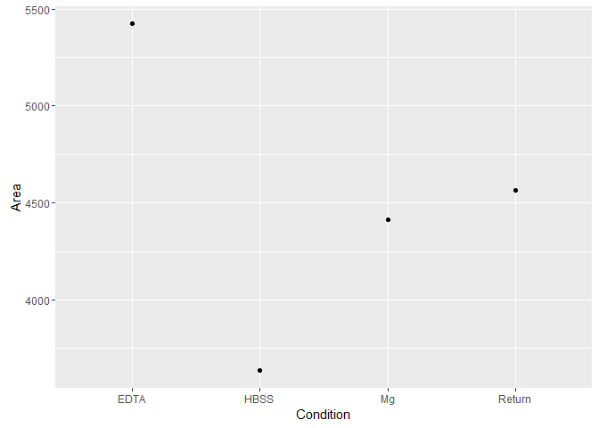
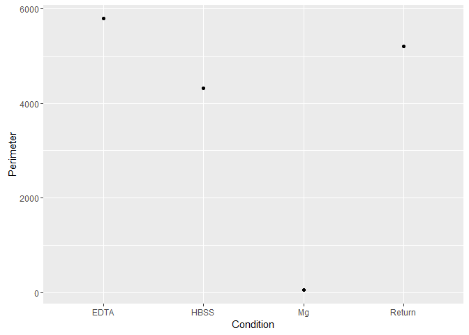

Introduction
============

In this document I will analyze the efficiency of BJ1-hTert cells that have been fixed with 2% formaldehyde in a normal, expanded, return from expanded, and contracted state. mFish allows us to label all chromosomes within a nucleus. Expansion with EDTA or contraction with MgCl2 can affect how chromatin is wound and can affect the shape of the nucleus. These conditions cause dramtic effects on the nucleus. EDTA can cause the nucleus to expand up to 10 times in volume. Furthermore, chromosomes are known to be segregated into territories and rarely interact with other chromosomes. To determine whether the nuclei size is maintained after mFish washes, we have measured nuclei after they were expanded/contracted and went through the mFish technique.

``` r
# Read in the data file
Expansion_dat <- read.csv("Test data.csv")

# Load ggplot2
library(ggplot2)

# Make a scatter plot of area per condition
expansion_area <- ggplot(Expansion_dat, aes(x=Condition, y=Area)) + geom_point() + geom_smooth(method=lm, se=FALSE)
print(expansion_area)
```



``` r
# Make a scatter plot of perimeter per condition
expansion_per <- ggplot(Expansion_dat, aes(x=Condition, y=Perimeter)) + geom_point() + geom_smooth(method=lm, se=FALSE)
print(expansion_per)
```



Results/Discussion
==================

The very limited results show that the area and perimeter of EDTA treated nuclei are much higher than normal (HBSS) and return. The Mg treatment had a higher area than HBSS. This is a bit surprising because Mg should cause the nuclei to shrink. This suggests that the mFish technique may not maintain the original size of samples.
