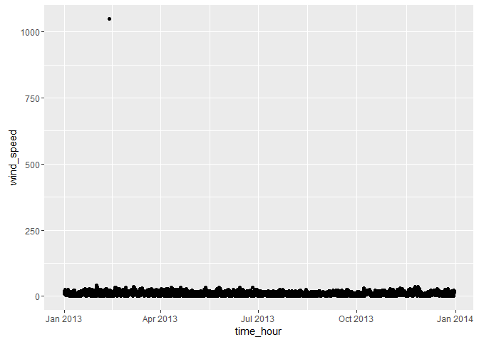
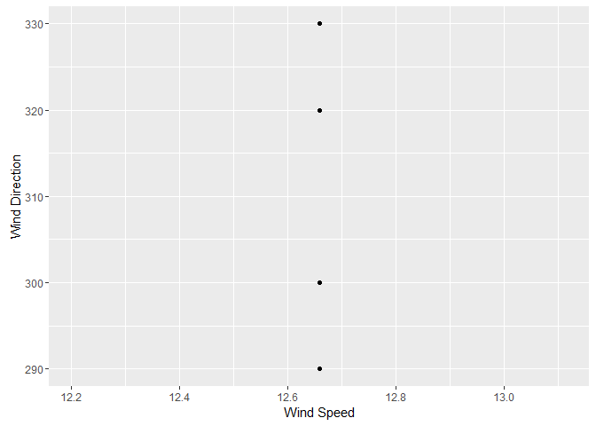
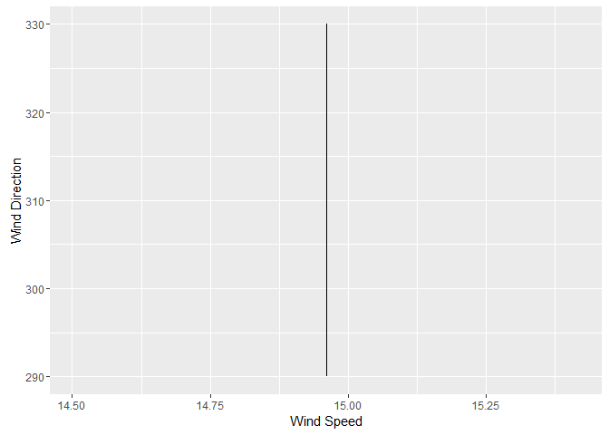
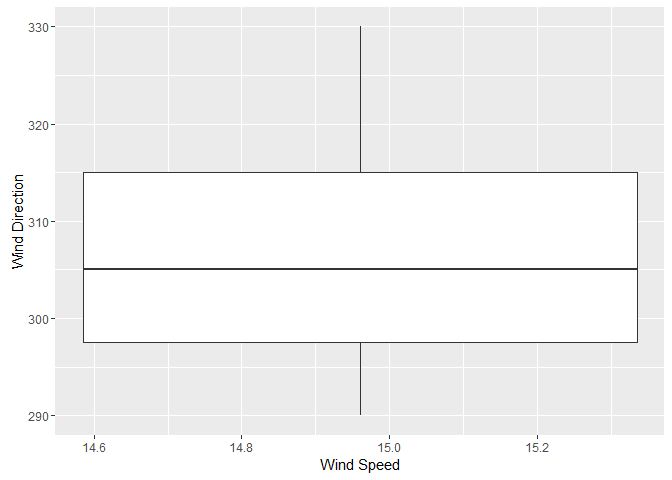
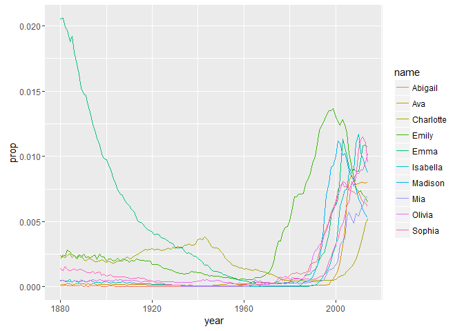
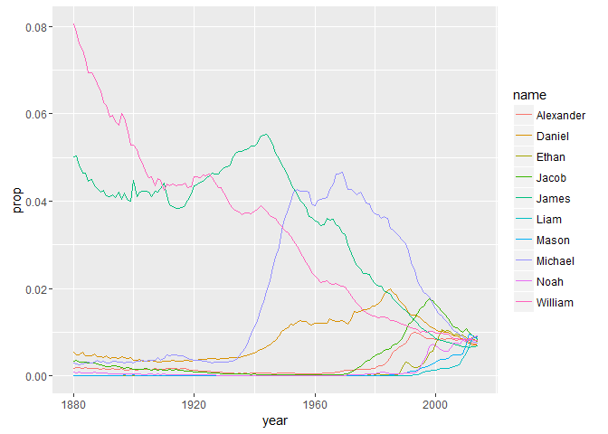
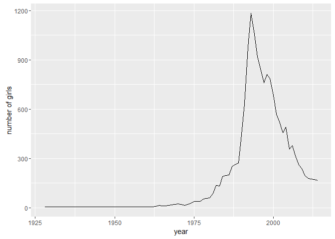

Using the nycflights13::weather:
--------------------------------

Determine whether there are any clear outliers in wind speed (wind\_speed) that should be rejected. If so, filter those bad point(s) and proceed.
=================================================================================================================================================

``` r
library(dplyr)
```

    ## 
    ## Attaching package: 'dplyr'

    ## The following objects are masked from 'package:stats':
    ## 
    ##     filter, lag

    ## The following objects are masked from 'package:base':
    ## 
    ##     intersect, setdiff, setequal, union

``` r
library(tidyverse)
```

    ## Loading tidyverse: ggplot2
    ## Loading tidyverse: tibble
    ## Loading tidyverse: tidyr
    ## Loading tidyverse: readr
    ## Loading tidyverse: purrr

    ## Conflicts with tidy packages ----------------------------------------------

    ## filter(): dplyr, stats
    ## lag():    dplyr, stats

``` r
library(nycflights13)

# Makes a data frame table with nycflights weather
nyc.weather <- nycflights13::weather

# Determine outliers that are contained in the data visually
nycwind_plot <- ggplot(nyc.weather, aes(x=time_hour, y=wind_speed)) + geom_point()
print(nycwind_plot)                       
```

    ## Warning: Removed 3 rows containing missing values (geom_point).



``` r
# Filter out the outliers that are artifacts from data collection
windspeed_filtered <- filter(nycflights13::weather, wind_speed < 200)
```

What direction has the highest median speed at each airport? Make a table and a plot of median wind speed by direction, for each airport.
-----------------------------------------------------------------------------------------------------------------------------------------

``` r
### Find direction with the highest median speed at each airport 

# Creates a dataframe that groups each airport by their wind speed
windspeed_dplyr <- nyc.weather %>%
  group_by(wind_speed) %>%
  filter(wind_speed < 200) %>%
  print(windspeed_dplyr)
```

    ## Source: local data frame [26,126 x 15]
    ## Groups: wind_speed [34]
    ## 
    ##    origin  year month   day  hour  temp  dewp humid wind_dir wind_speed
    ##     <chr> <dbl> <dbl> <int> <int> <dbl> <dbl> <dbl>    <dbl>      <dbl>
    ## 1     EWR  2013     1     1     0 37.04 21.92 53.97      230   10.35702
    ## 2     EWR  2013     1     1     1 37.04 21.92 53.97      230   13.80936
    ## 3     EWR  2013     1     1     2 37.94 21.92 52.09      230   12.65858
    ## 4     EWR  2013     1     1     3 37.94 23.00 54.51      230   13.80936
    ## 5     EWR  2013     1     1     4 37.94 24.08 57.04      240   14.96014
    ## 6     EWR  2013     1     1     6 39.02 26.06 59.37      270   10.35702
    ## 7     EWR  2013     1     1     7 39.02 26.96 61.63      250    8.05546
    ## 8     EWR  2013     1     1     8 39.02 28.04 64.43      240   11.50780
    ## 9     EWR  2013     1     1     9 39.92 28.04 62.21      250   12.65858
    ## 10    EWR  2013     1     1    10 39.02 28.04 64.43      260   12.65858
    ## # ... with 26,116 more rows, and 5 more variables: wind_gust <dbl>,
    ## #   precip <dbl>, pressure <dbl>, visib <dbl>, time_hour <dttm>

``` r
# Creates a dataframe that contains each airport and their median speed for each direction
med_windspeed = windspeed_dplyr %>%
  group_by(wind_dir, origin) %>%
  summarise(wind_spd_med = median(wind_speed)) %>%
  group_by(origin) %>%
  filter(wind_spd_med == max(wind_spd_med))

##### Makes tables and plots of median wind speed by direction, for each airport.
## Respective plots show the importance in choosing the right type of plot to covey your data.


EWR = med_windspeed %>%
  filter(origin == 'EWR')

ggplot(EWR, aes(wind_spd_med, wind_dir)) +
  geom_point() +
  xlab('Wind Speed') +
  ylab('Wind Direction')
```



``` r
JFK = med_windspeed %>%
  filter(origin == "JFK")

ggplot(JFK, aes(wind_spd_med, wind_dir)) +
  geom_line() +
  xlab('Wind Speed') +
  ylab('Wind Direction')
```



``` r
LGA = med_windspeed %>%
  filter(origin == "LGA")

ggplot(JFK, aes(wind_spd_med, wind_dir)) +
  geom_boxplot() +
  xlab('Wind Speed') +
  ylab('Wind Direction')
```



Using nycflights13::flights and nycflights13::airlines:
-------------------------------------------------------

Make a table with two columns: airline name (not carrier code) and median distance flown from JFK airport. The table should be arranged in order of decreasing mean flight distance. Hint: use a \_join function to join flights and airlines. \# Make a wide-format data frame that displays the number of flights that leave Newark ("EWR") airport each month, from each airline
===================================================================================================================================================================================================================================================================================================================================================================================

``` r
# Makes a table that joins flights and airlines
nyc_flights_air <- inner_join(nycflights13::flights, airlines)
```

    ## Joining, by = "carrier"

``` r
# Filters the nyc_flights_air table to include only the airline and mean distance ranked from highest to lowest
JFK_med_dist = nyc_flights_air %>%
  filter(origin == "JFK") %>%
  group_by(name) %>%
  summarise(med_dist_JFK = median(distance)) %>%
  arrange(desc(med_dist_JFK))
```

Make a wide-format data frame that displays the number of flights that leave Newark ("EWR") airport each month, from each airline
=================================================================================================================================

``` r
# Creates a wide format data frame that contains the number of flights that leave EWR each month
wide.frame <- nyc_flights_air %>%
  group_by(month, name) %>%
  summarise(month.airline = length(month)) %>%
  spread(name, month.airline)
```

Using the babynames dataset:
----------------------------

Identify the ten most common male and female names in 2014. Make a plot of their frequency (prop) since 1880. (This may require two separate piped statements).
===============================================================================================================================================================

``` r
library(babynames)

# Creates a table that contains baby names dataset
baby_names <- babynames::babynames
 
# Filters out top 10 names in 2014
## Jacob is number 4!
topnames = baby_names %>%
  filter(year == 2014) %>%
  group_by(sex) %>%
  top_n(10,n) %>%
  select(year, sex, name)

# Filters out the top 10 girl names in 2014
topgirl = baby_names %>%
  filter(year == 2014) %>%
  filter(sex == 'F') %>%
  top_n(10,n)

# Filters out the top 10 boy names in 2014 
topboy = baby_names %>%
  filter(year == 2014) %>%
  filter(sex == 'M') %>%
  top_n(10,n)

# Creates a table of the top names for girls between 1880 to 2014 by their frequency
name_girl <- baby_names %>%
  filter(sex == 'F') %>%
  filter(name %in% topgirl$name) %>%
  select(year,sex,name,prop) %>%
  group_by(name)

# Creates a table of the top names for girls between 1880 to 2014 by their frequency
name_boy <- baby_names %>%
  filter(sex == 'M') %>%
  filter(name %in% topboy$name) %>%
  select(year,sex,name,prop) %>%
  group_by(name)

# Plot that show frequency of girl names since 1880
ggplot(name_girl, aes(year, prop, color = name))+
  geom_line()
```



``` r
# Generates a line plot that shows frequency of boy names since 1880
ggplot(name_boy, aes(year, prop, color = name))+
  geom_line()
```



``` r
# Creates a table of common female names in 1896
common_1896 <- baby_names %>%
  select(year, sex, name, n) %>%
  filter(sex == 'F') %>%
  filter(year == 1896)

# Creates a table of common female names in 1942
common_1942 <- baby_names %>%
  select(year, sex, name, n) %>%
  filter(sex == 'F') %>%
  filter(year == 1942)

# Creates a table of common female names in 2014
common_2014 <- baby_names %>%
  select(year, sex, name, n) %>%
  filter(sex == 'F') %>%
  filter(year == 2014)
```

Make a single table of the 26th through 29th most common girls names in the year 1896, 1942, and 2016
=====================================================================================================

``` r
# Joins common names for females in 1896, 1942, and 2014
common_names_join = full_join(common_1896, common_1942)
```

    ## Joining, by = c("year", "sex", "name", "n")

``` r
common_names = full_join(common_names_join, common_2014)
```

    ## Joining, by = c("year", "sex", "name", "n")

``` r
# Generates a table with the most 26th through 29th most common names amongst girls in 1896, 1942, and 2014 
age26_29 = common_names %>%
  group_by(year) %>%
  top_n(29,n) %>%
  top_n(-4,n)
print(age26_29)
```

    ## Source: local data frame [12 x 4]
    ## Groups: year [3]
    ## 
    ##     year   sex     name     n
    ##    <dbl> <chr>    <chr> <int>
    ## 1   1896     F   Martha  2022
    ## 2   1896     F   Esther  1964
    ## 3   1896     F  Frances  1964
    ## 4   1896     F    Edith  1932
    ## 5   1942     F    Helen 10014
    ## 6   1942     F  Marilyn  9904
    ## 7   1942     F    Diane  9550
    ## 8   1942     F   Martha  9513
    ## 9   2014     F Brooklyn  6767
    ## 10  2014     F     Lily  6727
    ## 11  2014     F   Hannah  6512
    ## 12  2014     F    Layla  6428

Write task that involves some of the functions on the Data Wrangling Cheat Sheet and execute it.
------------------------------------------------------------------------------------------------

``` r
#### Write task that involves some of the functions on the Data Wrangling Cheat Sheet and execute it. 
## Determine how the frequency of girls to be named Tyler, which is my middle name, from 1880 to 2014.

# Creates a table of the frequency of girls named Tyler from 1880 to 2014
girl_Tyler = baby_names %>%
  filter(name == 'Tyler') %>%
  filter(sex == 'F')

# Generates a plot that visually shows the frequency of girls named Tyler
ggplot(girl_Tyler, aes(year, n)) +
  geom_line(stat = "identity") +
  xlab("year") +
  ylab("number of girls")
```


